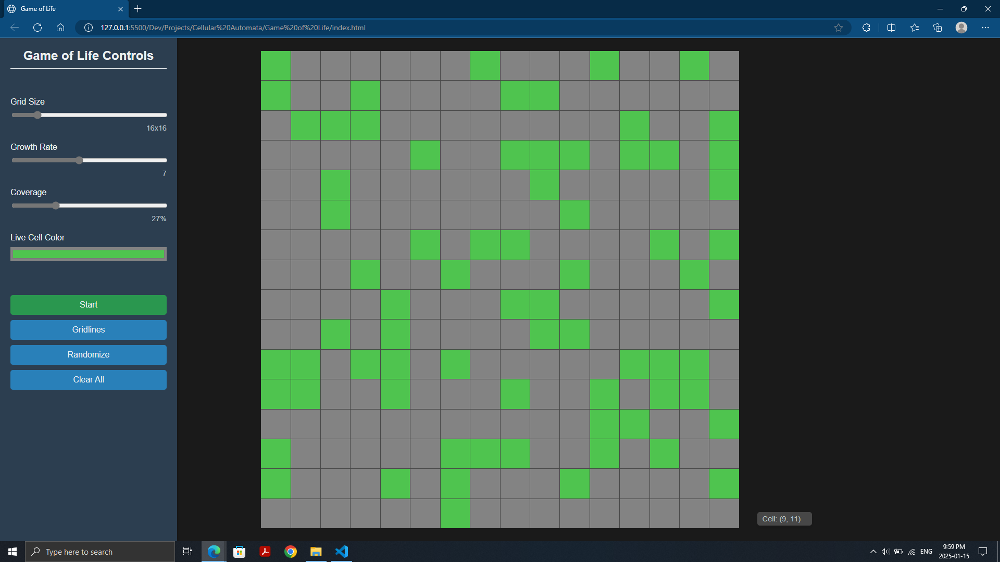

# Cellular Automata (CA)

A set of rules applied to some grid of cells. Each cell can have one of multiple states, and it's state for the next generation is dependent on the states of its surrounding _neighbors_ as well as its own. Each generation the grid is updated to reflect the evolution of the cells.

What we need to know to create a new CA ecosystem:

- __Universe:__
	- Grid shape (squares, triangles, hexagons)
	- Grid size (bounding box)
	- Dimension (1D, 2D)

- __Cell States:__
	- Binary (living or dead)
	- Multi-state

- __Neighborhood:__
	- What is this visibility of each cell?
	- 4 orthogonal neighbors (up, down, left, right)
	- 8 neighbors (surrounding cells including diagonals)
	- only diagonals
	- 2 rings around a cell

- __Rules:__
	- How will a cell change due to the states of its neighbors?
	- Based on number of neighbors of each type
	- Based on position of neighbors
	- You could also switch the ruleset used every other generation

## Conway's Game of Life

This CA implementation was devised by John Conway in 1970.

It operates on an infinite 2D grid of cells having only 2 states (alive or dead),  
&nbsp;and enforces a short list of simple rules:

1. __Underpopulation__
	- Any live cell with less than 2 neighbors dies

1. __Overpopulation__
	- Any live cell with more than 3 neighbors dies

1. __Survival__
	- Any live cell with 2 or 3 live neighbors continues living in the next generation
	- A result from rules 1 & 2

1. __Reproduction__
	- Any dead cell with exactly 3 live neighbors becomes a live cell


With different initial states of the grid, very intricate and interesting patterns can emerge.  Apparent randomness and complexity arise from simple rules—being completely deterministic.

People have studied Conway's Game of Life in search of self-replicating patterns and to better understand emergence properties.

[__Examples__:](https://en.wikipedia.org/wiki/Conway%27s_Game_of_Life#Examples_of_patterns)

- __Still lifes__
	- Perfectly sustainable, do not change over time

- __Oscillators__
	- Stationary patterns that are cyclic over a period

- __Spaceships__
	- Oscillators that move across the universe

- __Guns__
	- Oscillators that generate and emit spaceships

- [__Puffer Trains__](https://en.wikipedia.org/wiki/Puffer_train)
	- Spaceships that leave debris (other patterns) behind

- [__Rakes__](https://en.wikipedia.org/wiki/Rake_(cellular_automaton))
	- Puffers whose debris is a stream of spaceships
	- Like a gun that itself moves (like a spaceship)

- [__Breeders__](https://en.wikipedia.org/wiki/Breeder_(cellular_automaton))
	- Puffers that create life quadratically
	- They leave behind infinite gun debris, each of which generates infinite spaceships

<br>

> CA has been used to simulate natural phenomena (like the patterns of seashells), physical properties (like the dynamics of fluid), construct mazes, and create evolutionary art and music.

## Rulestrings

The rules for a [life-like](https://en.wikipedia.org/wiki/Life-like_cellular_automaton) cellular automaton can be compacted into the format:

`B{number list}/S{number list}`

This is known as birth/survival notation.

- The `B` section lists all the numbers of living neighbors that cause a dead cell to be _born_. 

- And `S` lists the numbers of living neighbors that permit a cell to _survive_.

For instance, the Game of Life has the rulestring `B3/S23`,  
indicating a living cell survives with 2 or 3 live neighbors, and a cell is born with exactly 3 live neighbors.

## Description
I have created a simulation to experiment with cellular automata using the Game of Life rules.

__Features:__

- Draw cells to life and watch them evolve!

- Control the growth rate of cells—animation speed

- Adjust grid size

- Randomize life on grid based on coverage (%)



## Controls

Click and drag over cells to toggle their state.

- Starting a stroke on a dead cell will paint cells to life.

- Starting on a living cell will erase cells.

<br>

| Shortcut    | Action                      |
|:-----------:|-----------------------------|
| `Spacebar`  | Start/pause animation       |
| `G`         | Toggle gridlines            |
| `R`         | Randomize living cells      |
| `E`         | Erase all cells             |

## Demo

https://github.com/user-attachments/assets/acc66ae5-e794-4514-be9f-b60ba9d6974a


## Hint

Try replicating this T-shape on a large grid and see what happens.

```
1 1 1
0 1 0
0 1 0
0 1 0
```

